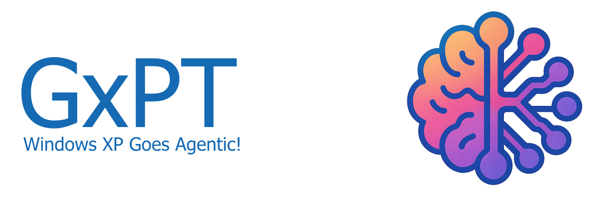
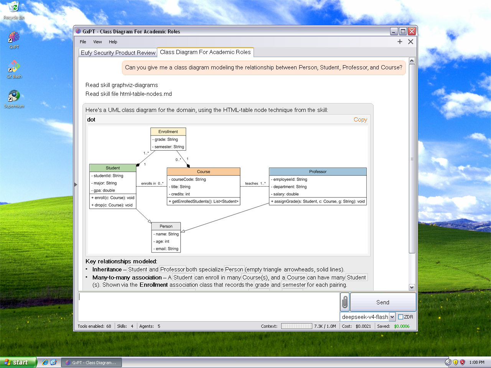

# GxPT

An agentic AI harness and coding agent for Windows XP. GxPT aims to provide modern agentic coding and AI chat features in a period-appropriate interface on legacy Windows systems. GxPT brings agentic web search, tool calling, custom skills, and sub-agent dispatching to the era of Luna and Aero, along with per-conversation privacy controls to keep your data safe.

## Screenshot

### Diagrams:

## Features

- **Legacy Compatibility**: Runs on Windows XP and .NET 3.5.
- **Modern Chat UI**: Clean, responsive chat transcript display.
- **Conversation Management**: Tabbed conversations and conversation history.
- **Markdown Rendering**: Supports headings, bold/italic, links, bullet and numbered lists (including deeply nested lists), tables, code blocks, and inline code.
- **File Attachments**: Attach text files, **images**, and **PDFs**. Images go to vision-capable models and PDFs use fast local text extraction (with full-document escalation and OCR when the model supports it).
- **Agentic Workflows**: GxPT autonomously chains tool calls until your task is done, powering **agentic coding** (file/git/shell/PowerShell), **web search & fetch**, and **GitHub** access. Each conversation has a movable working directory inside its workspace: `cd` into a subfolder or a **git worktree** and the file, git, and command tools follow, host-enforced so the model can't widen the root - and the workspace strip offers a one-click "Return to root". Tools connect via the [Model Context Protocol](https://modelcontextprotocol.io/); add custom servers in `mcp.json`.
- **Tool Approval & Sandboxing**: Every tool call is gated by an in-app approval prompt showing the exact tool and arguments before it runs, with approvals remembered per session. Command approvals add an **Explain** button that opens a fresh chat tab asking the model to break down exactly what a pending command does before you allow it. File/git/command tools are confined to the workspace you choose.
- **Skills**: Teach GxPT reusable workflows. Skills bundle instructions (and optional scripts) the model can pull in on demand. A built-in **skill-writer** helps you author your own, and you can enable skills per conversation or globally with the `/list-skills`, `/toggle-skills`, `/toggle-skill`, and `/use-skill` commands.
- **Sub-Agents**: Delegate self-contained tasks to specialist sub-agents that run their own loop in an isolated context and report back only their final answer - keeping the main conversation's context lean. Read-only agents fan out in parallel, every tool call still flows through the approval gate, and you can watch the agents as they run. Bundled specialists include **explore**, **plan**, **code-reviewer**, **verify**, **web-research**, and **general-purpose**.
- **Plugins**: Bundle a group of skills and agents into a single, shareable `.gxpl` plugin you can install, upgrade, enable/disable, and uninstall by name, all via the `Manage Plugins` window.
- **Code Syntax Highlighting**: Out-of-the-box support for a wide range of languages, including:
   - Ada, ASM, Bash, Basic, Batch, C, Clojure, C++, C#, CSS, CSV, Dart, EBNF, Elixir, Erlang, F#, Fortran, Go, Haskell, HTML, Java, JavaScript, JSON, Kotlin, Lisp (Common, Scheme/Racket, Clojure, Emacs), Lua, Markdown, OCaml, Pascal, Perl, PHP, PowerShell, Properties, Python, Ruby, Regex, Rust, Scala, SQL, Swift, TypeScript, Visual Basic, XML, YAML, Zig
- **Diagrams**: Ask the model for a diagram and GxPT renders it inline using a bundled Graphviz engine - flowcharts, UML-style class diagrams, dependency graphs, ER diagrams, state machines, workflow DAGs, and more. Large diagrams open in an interactive pan/zoom viewer (scroll to zoom, drag to pan), and each rendered graph carries a Copy button for its source.
- **Interactive Questions**: When the model needs a decision from you, it can ask a multiple-choice (or multi-select) question right in the transcript - pick an option, check several, or type your own answer in the always-available *Other* field - and the agent waits for your reply before continuing.
- **Prompt Caching**: Requests are automatically structured into cache-friendly zones with provider cache breakpoints and sticky provider routing that keeps follow-up requests on the warm cache - cutting input costs by up to ~90% on long agentic sessions.
- **AGENTS.md Support**: Drop an `AGENTS.md` file in your workspace root and GxPT automatically injects those project instructions into the agent's system prompt, following the same cross-tool convention used by other coding agents.
- **Persistent Memory**: GxPT can record durable facts about each workspace and recall them in later conversations, so context carries over without re-explaining your project. Toggle it and set a size limit in settings.
- **Usage Status Bar**: Live per-conversation telemetry at the bottom of the window: a context meter showing how full the model's context window is, plus running cost and cache-savings totals reconciled against OpenRouter's billed usage.
- **Slash Commands**: Type `/` for quick actions with autocomplete, including `/model` (switch models), `/tool` (toggle MCP servers), `/new`, `/export` (conversations, or skills and agents as a shareable `.gxpl` plugin), `/import`, `/plugin` (manage installed plugins), and `/compact`.
- **Recent Workspaces**: Quickly reattach to the workspaces you used most recently, with a workspace strip showing the active folder at a glance.
- **Conversation Editing**: Don't like the response a model gave you? Go back and edit your message and get a new response.
- **Privacy & Local Storage**: Conversations are stored locally and can be exported/imported to migrate across machines. Enforce **Zero Data Retention (ZDR)** per conversation to route only to providers that won't store your prompts or responses.
- **Frontier Model Support**: Support for a huge range of AI models, including frontier models, from the OpenRouter.ai API. 

## Getting Started

1. **Requirements**
   - Windows XP or later (XP optimized)
   - .NET Framework 3.5

2. **Building & Running**
   - Open the solution in Visual Studio 2008 or later.
   - Build the solution for release; required libraries are included. This also builds the bundled MCP servers (file/git/command/web), which are deployed alongside `GxPT.exe`.
   - Build the setup project for release.
   - Run `GxPT.exe` in `GxPT\bin\Release`, or install via `GxPT.Setup.msi` in `GxPT.Setup\bin\Release`.

3. **Configuration**
   - Launch the app and open the settings window to configure your API key and preferences.
   - See the in-app help page for instructions on obtaining and entering an OpenRouter API key.
   - To enable tools, open the **Tools** tab in settings: toggle the built-in servers, paste a Tavily key (web search) or GitHub PAT, and edit `mcp.json` for custom servers. File, git, and command tools activate once you set a workspace for a conversation.