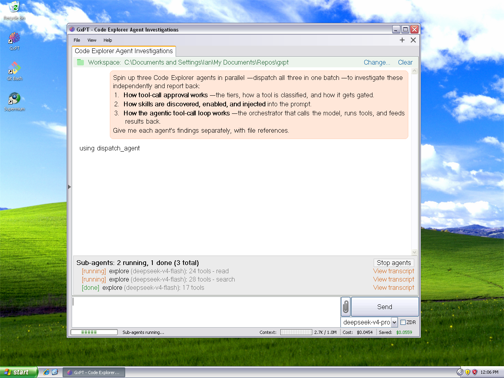

# GxPT

A native chatbot client and coding agent for Windows XP. GxPT aims to provide a modern and user-friendly chat interface on legacy Windows systems, with robust Markdown and code syntax highlighting support. It also brings agentic workflows to the era of Luna and Aero - autonomously chaining tools for agentic coding and web search via the Model Context Protocol (MCP), with per-conversation privacy controls.

## Screenshot

### Subagents:

## Features

- **Modern Chat UI**: Clean, responsive chat transcript display.
- **Markdown Rendering**: Supports headings, bold/italic, links, bullet and numbered lists (including deeply nested lists), tables, code blocks, and inline code.
- **Code Syntax Highlighting**: Out-of-the-box support for a wide range of languages, including:
   - Ada, ASM, Bash, Basic, Batch, C, Clojure, C++, C#, CSS, CSV, Dart, EBNF, Elixir, Erlang, F#, Fortran, Go, Haskell, HTML, Java, JavaScript, JSON, Kotlin, Lisp (Common, Scheme/Racket, Clojure, Emacs), Lua, Markdown, OCaml, Pascal, Perl, PHP, PowerShell, Properties, Python, Ruby, Regex, Rust, Scala, SQL, Swift, TypeScript, Visual Basic, XML, YAML, Zig
- **Conversation Management**: Tabbed conversations and conversation history.
- **Agentic Workflows**: GxPT autonomously chains tool calls until your task is done, powering **agentic coding** (file/git/shell), **web search & fetch**, and **GitHub** access. Tools connect via the [Model Context Protocol](https://modelcontextprotocol.io/); add custom servers in `mcp.json`.
- **AGENTS.md Support**: Drop an `AGENTS.md` file in your workspace root and GxPT automatically injects those project instructions into the agent's system prompt, following the same cross-tool convention used by other coding agents.
- **Skills**: Teach GxPT reusable workflows. Skills bundle instructions (and optional scripts) the model can pull in on demand. A built-in **skill-writer** helps you author your own, and you can enable skills per conversation or globally with the `/list-skills`, `/toggle-skills`, `/toggle-skill`, and `/use-skill` commands.
- **Sub-Agents**: Delegate self-contained tasks to specialist sub-agents that run their own loop in an isolated context and report back only their final answer - keeping the main conversation's context lean. Each agent is a markdown file (`agents/<slug>.md`) whose frontmatter defines a tool allowlist, a capability tier, and a turn budget, with the same project/user/bundled discovery as skills. Read-only agents fan out in parallel, every tool call still flows through the approval gate, and running agents are surfaced in-transcript with a `Stop N agents` control. Bundled specialists include **explore**, **plan**, **code-reviewer**, **verify**, **web-research**, and **general-purpose**. Enable the feature per conversation or globally with `/toggle-agents`, and delegate explicitly with `/dispatch-agent`.
- **Persistent Memory**: GxPT can record durable facts about each workspace and recall them in later conversations, so context carries over without re-explaining your project. Toggle it and set a size limit in settings.
- **Tool Approval & Sandboxing**: Every tool call is gated by an in-app approval prompt showing the exact tool and arguments before it runs, with approvals remembered per session. File/git/command tools are confined to the workspace you choose.
- **Prompt Caching**: Requests are automatically structured into cache-friendly zones with provider cache breakpoints and sticky provider routing that keeps follow-up requests on the warm cache - cutting input costs by up to ~90% on long agentic sessions.
- **Usage Status Bar**: Live per-conversation telemetry at the bottom of the window: a context meter showing how full the model's context window is, plus running cost and cache-savings totals reconciled against OpenRouter's billed usage.
- **Slash Commands**: Type `/` for quick actions with autocomplete, including `/model` (switch models), `/tool` (toggle MCP servers), `/new`, `/export` (conversations, or a single skill as a shareable `.gxsk` archive), `/import`, and `/compact`.
- **Recent Workspaces**: Quickly reattach to the workspaces you used most recently, with a workspace strip showing the active folder at a glance.
- **File Attachments**: Add text file attachments to your messages to avoid cluttering up the conversation with long pasted text.
- **Conversation Editing**: Don't like the response a model gave you? Go back and edit your message and get a new response.
- **Privacy & Local Storage**: Conversations are stored locally and can be exported/imported to migrate across machines. Enforce **Zero Data Retention (ZDR)** per conversation to route only to providers that won't store your prompts or responses.
- **Frontier Model Support**: Support for a huge range of AI models, including frontier models, from the OpenRouter.ai API. 
- **Legacy Compatibility**: Runs on Windows XP and .NET 3.5.

## Getting Started

1. **Requirements**
   - Windows XP or later (XP optimized)
   - .NET Framework 3.5

2. **Building & Running**
   - Open the solution in Visual Studio 2008 or later.
   - Build the solution; required libraries are included. This also builds the bundled MCP servers (file/git/command/web), which are deployed alongside `GxPT.exe`.
   - Build the setup project.
   - Run `GxPT.exe`, or install via `GxPT.Setup.msi`. 

3. **Configuration**
   - Launch the app and open the settings window to configure your API key and preferences.
   - See the in-app help page for instructions on obtaining and entering an OpenRouter API key.
   - To enable tools, open the **MCP** tab in settings: toggle the built-in servers, paste a Tavily key (web search) or GitHub PAT, and edit `mcp.json` for custom servers. File, git, and command tools activate once you set a workspace for a conversation.