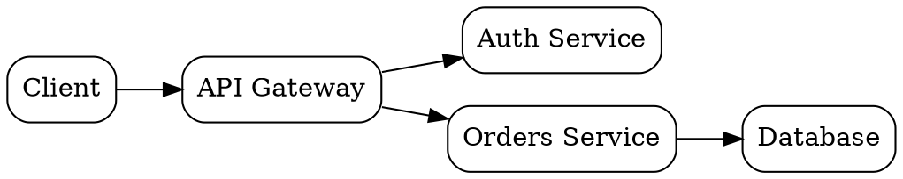

GxPT renders graph code fences **inline as images**. Emit a fenced code block whose **language is
the Graphviz layout engine** you want, and the rendered graph appears in the chat bubble (with a
Copy button that copies the DOT source). This is the right tool whenever structure or relationships
are clearer seen than described.

You already know the DOT language - this skill is about using it well *inside GxPT*: when to draw,
which engine to pick, and the rules that keep a graph from silently falling back to plain code.

## When to draw (and when not)

Draw a graph when the thing is fundamentally **nodes and edges**: an architecture or component
diagram, a class/type hierarchy, a dependency or call graph, a state machine, a control-/data-flow,
an ER diagram, a decision tree, a pipeline, an org chart. Prefer a graph over ASCII art every time -
the rendered image is clearer and the source stays available via Copy.

Don't force it. Plain prose, a list, or a Markdown table is better for sequential steps with no
branching, flat key/value data, or anything that isn't really a relationship.

## Pick the engine with the fence language

The fence language selects the layout. Only these render; any other language is shown as ordinary
code, so use one of them exactly:

| Fence | Engine | Best for |
|---|---|---|
| ` ```dot ` (also `graphviz`, `gv`) | dot | Directed hierarchies and flows - trees, dependencies, state machines, pipelines. The default choice. |
| ` ```neato ` | neato | Undirected relationship graphs with no hierarchy; compact, roughly square. |
| ` ```fdp ` | fdp | Like neato but lays out `subgraph cluster_*` groupings (grouped modules/packages). |
| ` ```twopi ` | twopi | Radial - one central node with everything arranged in rings around it. |
| ` ```circo ` | circo | Circular - cyclic or ring-shaped structures. |

Rule of thumb: reach for **dot** first. Switch to **neato**/**fdp** when a graph has many cross-links
and no real top-to-bottom direction (dot makes those tall and tangled; the force-directed engines
keep them compact). Use **twopi**/**circo** only when the radial/circular shape genuinely matches.

## Rules that keep it rendering

- **Make it valid, complete DOT.** GxPT only renders once the source parses and its braces balance;
  a syntax error or an unclosed graph just shows up as a code block. Always close the graph with `}`.
- **Only the graph goes in the fence.** No prose to the user, no `...`, no placeholder comments -
  put explanation in normal text before or after the block.
- **It becomes a white-background PNG scaled to fit the bubble width.** Keep graphs reasonably sized.
  For a wide-but-shallow flow, set `rankdir=LR` so it reads left-to-right instead of getting tall.
  For a big relationship graph, prefer neato/fdp so it stays compact rather than a giant dot tree.
- **Keep labels short and quote them when needed.** Wrap any label with spaces or special characters
  in double quotes (`"Auth Service"`), and use `\n` for line breaks inside a label.
- **One image per fence.** Need several diagrams? Use several fences; each renders separately.

## Examples

A directed flow with `dot` (note `rankdir=LR` to keep it wide rather than tall):



A relationship graph with `neato`, where there's no hierarchy to impose:

```neato
graph {
  node [shape=ellipse];
  Users -- Orders;
  Orders -- Products;
  Users -- Reviews;
  Products -- Reviews;
}
```

## Multi-compartment nodes (UML classes, ER entities, DB tables)

When a node needs several rows - a UML class with a name / attributes / operations stack, an ER
entity, a database table, a component box with a header and a body - its label is an HTML `<table>`
(`label=<...>`) rather than plain text. These nodes have their own rules, and getting them wrong is
what makes a hand-written class box look double-bordered, cramped, or covered in oversized
overlapping edge labels. The essentials:

- `shape=none, margin=0` on the node defaults are **mandatory** for any `<table>` label.
- Separate compartments with `<hr/>` rules, and set a small `edge [fontsize=10]` so association
  labels don't render oversized.
- `splines=ortho`, compass port anchors, and `headlabel`/`taillabel` multiplicity each have
  gotchas.

**Before drawing one, read `html-table-nodes.md` in this skill folder** (with `read_skill_file`) -
it has the full recipe, the reasoning behind each rule, and a worked class-diagram example. None of
this applies to plain-text labels, so only reach for it when a node's label is actually a `<table>`.
