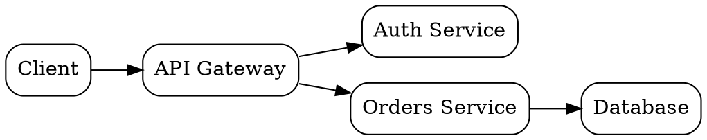
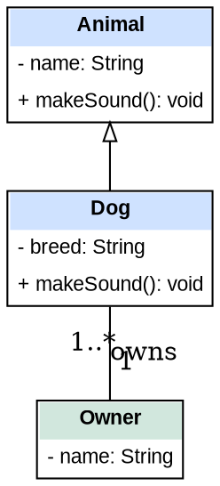

GxPT renders graph code fences **inline as images**. Emit a fenced code block whose **language is
the Graphviz layout engine** you want, and the rendered graph appears in the chat bubble (with a
Copy button that copies the DOT source). This is the right tool whenever structure or relationships
are clearer seen than described.

You already know the DOT language - this skill is about using it well *inside GxPT*: when to draw,
which engine to pick, and the rules that keep a graph from silently falling back to plain code.

## When to draw (and when not)

Draw a graph when the thing is fundamentally **nodes and edges**: an architecture or component
diagram, a class/type hierarchy, a dependency or call graph, a state machine, a control-/data-flow,
an ER diagram, a decision tree, a pipeline, an org chart. Prefer a graph over ASCII art every time -
the rendered image is clearer and the source stays available via Copy.

Don't force it. Plain prose, a list, or a Markdown table is better for sequential steps with no
branching, flat key/value data, or anything that isn't really a relationship.

## Pick the engine with the fence language

The fence language selects the layout. Only these render; any other language is shown as ordinary
code, so use one of them exactly:

| Fence | Engine | Best for |
|---|---|---|
| ` ```dot ` (also `graphviz`, `gv`) | dot | Directed hierarchies and flows - trees, dependencies, state machines, pipelines. The default choice. |
| ` ```neato ` | neato | Undirected relationship graphs with no hierarchy; compact, roughly square. |
| ` ```fdp ` | fdp | Like neato but lays out `subgraph cluster_*` groupings (grouped modules/packages). |
| ` ```twopi ` | twopi | Radial - one central node with everything arranged in rings around it. |
| ` ```circo ` | circo | Circular - cyclic or ring-shaped structures. |

Rule of thumb: reach for **dot** first. Switch to **neato**/**fdp** when a graph has many cross-links
and no real top-to-bottom direction (dot makes those tall and tangled; the force-directed engines
keep them compact). Use **twopi**/**circo** only when the radial/circular shape genuinely matches.

## Rules that keep it rendering

- **Make it valid, complete DOT.** GxPT only renders once the source parses and its braces balance;
  a syntax error or an unclosed graph just shows up as a code block. Always close the graph with `}`.
- **Only the graph goes in the fence.** No prose to the user, no `...`, no placeholder comments -
  put explanation in normal text before or after the block.
- **It becomes a white-background PNG scaled to fit the bubble width.** Keep graphs reasonably sized.
  For a wide-but-shallow flow, set `rankdir=LR` so it reads left-to-right instead of getting tall.
  For a big relationship graph, prefer neato/fdp so it stays compact rather than a giant dot tree.
- **Keep labels short and quote them when needed.** Wrap any label with spaces or special characters
  in double quotes (`"Auth Service"`), and use `\n` for line breaks inside a label.
- **One image per fence.** Need several diagrams? Use several fences; each renders separately.

## Examples

A directed flow with `dot` (note `rankdir=LR` to keep it wide rather than tall):



A relationship graph with `neato`, where there's no hierarchy to impose:

```neato
graph {
  node [shape=ellipse];
  Users -- Orders;
  Orders -- Products;
  Users -- Reviews;
  Products -- Reviews;
}
```

## UML-style and structured HTML-label nodes

Multi-compartment boxes - UML classes, ER entities, database tables, component boxes with a
header and a body - are drawn with an **HTML table label** (`label=<...>`), the standard way to
get several rows inside one node. Two defaults sabotage these, and both must be overridden on the
node defaults:

```dot
node [shape=none, margin=0, fontname="Arial", fontsize=11];
```

- **`shape=none`** suppresses the node's own shape. Without it, the default shape (or `shape=plain`)
  draws a border around the *whole node* in addition to the borders of your `<table>`/`<td>`, so
  every box appears double-bordered.
- **`margin=0`** pulls the node's logical boundary tight against the table. Even with `shape=none`,
  Graphviz keeps a default margin around the label, so the node's edge sits *outside* the visible
  table - and edges then attach to that invisible boundary, leaving arrows looking detached from
  the box.

These two settings are universal to **any node whose label is an HTML `<table>`**: UML class
diagrams, ER diagrams, database schemas, component/deployment boxes, swim-lane or action nodes -
anywhere a table replaces a plain text label. They do **not** apply to plain-text labels
(`label="Customer"` on a `shape=box, style=rounded`); that case has neither problem, so only reach
for `shape=none, margin=0` when you're actually using a `<table>` label.

### Three routing constraints these nodes impose

Because `shape=none, margin=0` tightens the logical boundary right up against the table, edge
routing around these nodes gets fragile in three specific ways. They apply equally to UML class
diagrams, ER diagrams, database schema diagrams, component/deployment diagrams, and any other
diagram where a structured multi-row HTML table replaces a plain text label.

- **`splines=ortho` needs a real node boundary - give it one with `shape=box`.** Ortho forces
  every edge into right-angle segments and computes its corner points from the node's geometry.
  With `shape=none` the node has no shape of its own, so its boundary is *inferred* from the label
  size and pulled tight against the table - the router can't find valid attachment points and ends
  up routing *through* the node interior. The fix is to give the node a genuine rectangle: switch
  `shape=none` to `shape=box` and set the `<table>`'s `border="0"` so the box draws the single
  outer border (no double border) and ortho attaches to it cleanly. The trade-off is that the
  outer border is now a single enclosing rectangle: rounded corners, color, and thickness are
  still available (`style=rounded`, `color`, `penwidth` on the node), but border effects that
  aren't one uniform rectangle are not - a border offset from the cells via `cellspacing`, or a
  partial/per-side outer border such as a rule under just the header. Inner `cellborder` row
  separators are unaffected either way. If you don't need ortho, plain `shape=none` with the
  default spline router also attaches to the border correctly; reach for `shape=box` only when you
  want ortho and a plain rectangular outer border is acceptable.

- **Omit compass port anchors (`:e`, `:w`, `:n`, `:s`) on HTML-table nodes.** With `shape=none`
  the node's logical boundary is derived from the label's computed size and can be misaligned from
  the rendered table edge, so `Node:e` / `Node:w` attach to that invisible boundary - arrows look
  detached or start/end inside the box. Let Graphviz pick the nearest border point automatically.
  The one exception is a named cell port (`<td port="pk">...</td>`), which targets a specific cell
  *inside* the table and does attach reliably; reference it as `Node:pk`.

- **Tune `labeldistance` and `labelangle` for `headlabel`/`taillabel`.** Their defaults place
  multiplicity/role labels right at the arrowhead, where they overlap the node border - worse on
  nodes made wide by long table content. A `labeldistance` around `2.0`-`2.5` plus a `labelangle`
  that pushes the label off the edge line clears it. These are layout-specific adjustments, not
  fixed defaults: the right values depend on node size and edge direction, so expect to tweak them
  per diagram.

A UML class diagram - colored header `<td>`, separate rows for attributes and operations,
inheritance via an empty arrowhead, and an association with quoted multiplicity labels pushed
clear of the boxes via `labeldistance`/`labelangle`. It uses `shape=none` with the default spline
router and no port anchors; to route these edges with `splines=ortho` instead, switch the node
default to `shape=box` and set each `<table>`'s `border="0"` as described above:


