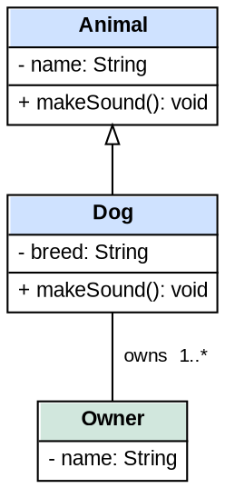

# Structured HTML-table nodes (UML, ER, schemas)

Multi-compartment boxes - UML classes, ER entities, database tables, component boxes with a
header and a body - are drawn with an **HTML `<table>` label** (`label=<...>`), the standard way to
get several rows inside one node. Read this file whenever a node's label is a `<table>`; the rules
below are what separate a clean class box from a cramped, double-bordered, overlapping one.

## The two mandatory node defaults

Two Graphviz defaults sabotage table nodes, and both must be overridden on the node defaults:

```dot
node [shape=none, margin=0, fontname="Arial", fontsize=11];
```

- **`shape=none`** suppresses the node's own shape. Without it, the default shape (or `shape=plain`)
  draws a border around the *whole node* in addition to the borders of your `<table>`/`<td>`, so
  every box appears double-bordered.
- **`margin=0`** pulls the node's logical boundary tight against the table. Even with `shape=none`,
  Graphviz keeps a default margin around the label, so the node's edge sits *outside* the visible
  table - and edges then attach to that invisible boundary, leaving arrows looking detached from
  the box.

These apply to **any node whose label is an HTML `<table>`**: UML class diagrams, ER diagrams,
database schemas, component/deployment boxes, swim-lane or action nodes. They do **not** apply to
plain-text labels (`label="Customer"` on a `shape=box, style=rounded`); that case has neither
problem, so only reach for `shape=none, margin=0` when you're actually using a `<table>` label.

## Compartment dividers - use `<hr/>`

A UML class or ER entity reads as a stack of compartments - name, then attributes, then operations
- separated by horizontal rules. Put those rules in with `<hr/>` between the row groups, on a table
that draws a single outer border (`border="1" cellborder="0"`):

```dot
<table border="1" cellborder="0" cellspacing="0" cellpadding="4">
  <tr><td bgcolor="#cfe2ff"><b>ClassName</b></td></tr>
  <hr/>
  <tr><td align="left">- field: Type</td></tr>
  <hr/>
  <tr><td align="left">+ method(): Type</td></tr>
</table>
```

Without the `<hr/>` rules the compartments blur into one block separated only by blank space - the
single most common reason a hand-written class box looks worse than it should. (`cellborder="1"` on
the whole table is an alternative: it draws a line around *every* cell, which also separates the
compartments but boxes each one individually rather than giving the classic header-rule look.)

## Keep edge and association labels legible - set an edge font

Edge labels (association names, multiplicity, roles) **default to a larger font than your nodes** -
Graphviz edges render at roughly 14pt regardless of the node `fontsize`. On a class diagram that
makes association labels tower over the class text and collide with each other where edges cross.
Set an edge default that matches the nodes:

```dot
edge [fontname="Arial", fontsize=10];
```

This single line is usually the difference between readable association labels and an overlapping
mess - it is the most common fix for a class diagram whose edge text looks oversized.

## Multiplicity and role labels

Two ways to place a multiplicity (`1`, `*`, `1..*`):

- **Inline in the edge `label` - simplest and most predictable.** Write the multiplicity straight
  into the association label, with a couple of leading spaces to push it off the line:
  `label="  teaches  1..*"`. One label, one position, nothing to tune. Reach for this by default.
- **`headlabel` / `taillabel` - proper UML, but fiddlier.** These pin a separate label at each
  association end (the textbook way to show the multiplicity nearest each class). Their defaults sit
  right on the arrowhead and overlap the node border, so you must tune `labeldistance` (≈2.0-2.5)
  and `labelangle` to push them clear, and the right values depend on node size and edge direction.
  Use these only when end-precise multiplicity matters; expect per-diagram tweaking, and always pair
  them with the small edge `fontsize` above or they overlap badly.

## Two routing constraints

`shape=none, margin=0` tightens the logical boundary against the table, which makes edge routing
fragile in two specific ways:

- **`splines=ortho` needs a real node boundary - give it one with `shape=box`.** Ortho forces every
  edge into right-angle segments and computes its corner points from the node's geometry. With
  `shape=none` the node has no shape of its own, so its boundary is inferred from the label size and
  pulled tight against the table - the router can't find valid attachment points and routes *through*
  the node interior. The fix: switch `shape=none` to `shape=box` and set the `<table>`'s `border="0"`
  so the box draws the single outer border (no double border) and ortho attaches cleanly. The
  trade-off is that the outer border is now a square rectangle drawn by the node: `color` and
  `penwidth` work, but keep the corners square - **do not add `style=rounded`** on a `shape=box`
  table node. The box rounds only the outline, not the square `bgcolor` cell fills, so a colored
  header bleeds past the rounded corner (and `cellspacing` insets don't reliably hide it across
  Graphviz versions). If you need rounded corners, keep `shape=none` (where the table draws its own
  border and `<table style="rounded">` clips the fill correctly) and don't use ortho. In short:
  `shape=box` + `border="0"` for ortho with a plain square border; `shape=none` + the default spline
  router for anything fancier.

- **Omit compass port anchors (`:e`, `:w`, `:n`, `:s`).** With `shape=none` the node's logical
  boundary is derived from the label's computed size and can be misaligned from the rendered table
  edge, so `Node:e` / `Node:w` attach to that invisible boundary - arrows look detached or start/end
  inside the box. Let Graphviz pick the nearest border point automatically. The one exception is a
  named cell port (`<td port="pk">...</td>`), which targets a specific cell *inside* the table and
  does attach reliably; reference it as `Node:pk`.

## A worked example

A UML class diagram pulling the rules together - `shape=none, margin=0` node defaults, a small edge
font, `<hr/>` compartment dividers, inheritance via a hollow (empty) arrowhead, and an association
with inline multiplicity:


